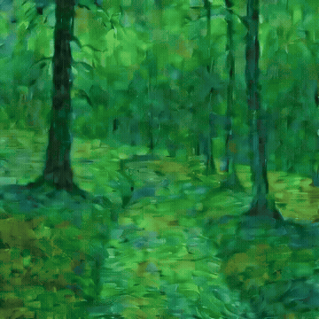
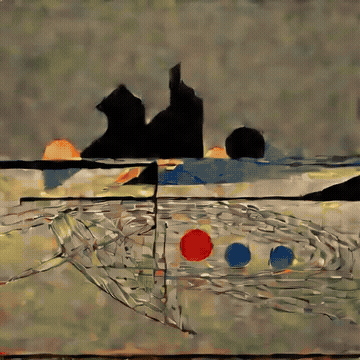
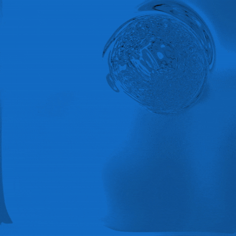
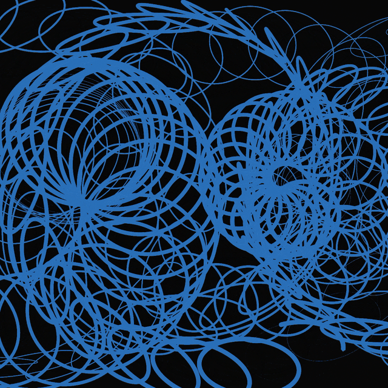
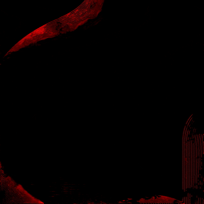
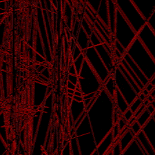
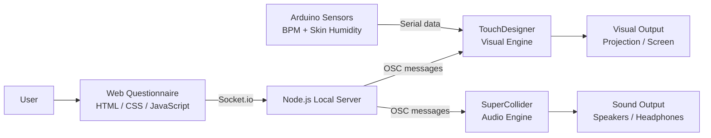
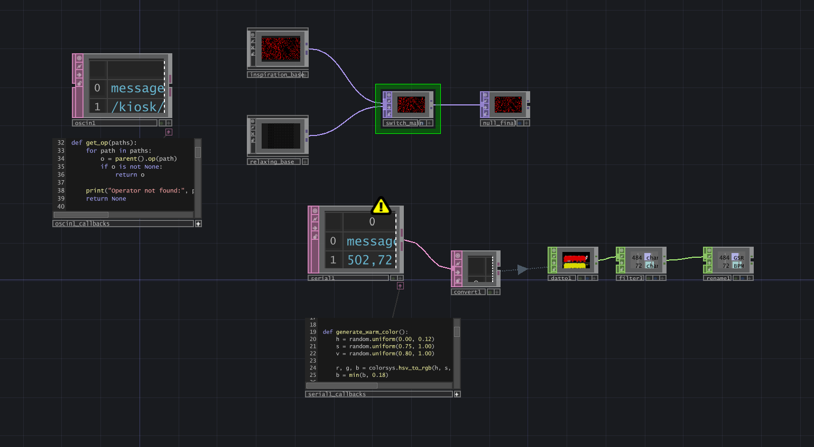
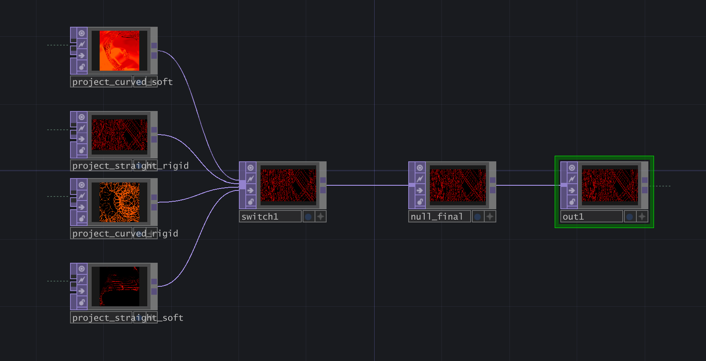
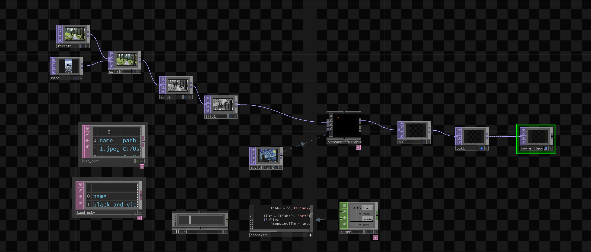

<p align="center">
  
</p>
<p align="center">
  <em>Escape Cube is an immersive experience: a room equipped with projectors and speakers, designed to be a safe place where you can disconnect and recover from stress.</em>
</p>

---

## Table of Contents

- [Introduction](#introduction)
- [Experience](#experience)
- [System Architecture and Audiovisual System](#system-architecture)
  - [Visual System: TouchDesigner](#visual-system)
  - [Inspirational Path](#inspirational-path)
  - [Relaxing Path](#relaxing-path)
  - [Audio System: SuperCollider](#audio-system)
  - [Sensor Mapping](#sensor-mapping)
- [How to Run It](#how-to-run-it)
- [Team](#team)
- [Technologies](#technologies)
- [Challenges, Accomplishments and Lessons Learned](#challenges)
- [Video Demo](#video-demo)

---

<a id="introduction"></a>

## Introduction

Escape Cube is an immersive audiovisual project designed to offer a new way to relax in situations of high stress.

Instead of removing stimuli to disconnect from the outside world, Escape Cube proposes a different approach: it carefully selects and manages stimuli to create a controlled and intentional environment.

The project creates a protected and customizable immersive space where users are surrounded by sound, images, color, and movement. The goal is not to escape reality by turning everything off, but to enter an environment where every element is coherent and non-invasive.

Escape Cube is designed for contexts where stress and overstimulation are common, such as workplaces, universities, concerts, festivals, and cultural spaces. It offers a temporary pause: a place to slow down, breathe, and immerse oneself in an audiovisual experience.

While the full version requires a dedicated physical setup, this repository provides a demo that can be experienced on a personal computer using a screen and headphones.


---

<a id="experience"></a>

## Experience

The interaction between the user and Escape Cube takes place through a few simple steps.

First, the user is invited to complete a short questionnaire through a web interface. They can choose to skip the personalization process and enter the experience directly, or answer a few visual questions to tailor the experience to their current state.

The first choice is between two main types of experience: Relaxing and Inspirational.

In the Relaxing path, the user enters calm, nature-based scenes reinterpreted through artistic styles, designed to create a peaceful and contemplative atmosphere.

In the Inspirational path, the user is immersed in abstract generative visuals, where shapes, colors, and movement create a more expressive and imaginative environment.

<p>
  
  
</p>
<p>
  
  
</p>

Once inside, the projections on the walls and the audio are shaped around your choices. For those who want an even more immersive experience, the room is equipped with wearable sensors that measure heart rate and skin humidity, adjusting the projections in real time accordingly.

The visuals projected inside the room are generated in real time by **TouchDesigner**, which can drive a Stable Diffusion pipeline to produce AI-generated images. The result is a continuously evolving environment. Here are some examples:

<p align="center">
  
  
</p>
<p align="center">
  
  
</p>
<p align="center">
  
  
</p>

At this point, there is only one thing left to do: enter the cube, let go, and abandon oneself to sound and images.

---

<a id="system-architecture"></a>

## System Architecture and Audiovisual System

Escape Cube is built as a modular real-time system that connects a web questionnaire, a visual engine, an audio engine, and a sensor layer.

The interaction starts from the web interface, where the user selects the type of experience and the main aesthetic parameters. The answers are sent to a Node.js local server, which acts as a communication bridge between the different parts of the system. From there, the server forwards OSC messages to TouchDesigner, which generates and controls the visuals, and to SuperCollider, which manages the soundscape.

The biometric sensors are connected through Arduino and send real-time values to TouchDesigner. These values do not completely change the selected experience, but gently modulate specific parameters such as movement speed, color variation, diffusion weight, and visual transformation.



This structure allows the system to combine an initial layer of personalization, based on the questionnaire, with a second layer of real-time adaptation, based on the user’s physiological data.

<a id="visual-system"></a>

### Visual System: TouchDesigner

The visual system is developed in TouchDesigner and is organized around two main types of experience: Inspirational and Relaxing.

The questionnaire defines the starting point of the visual experience, while the sensors modify selected parameters during the session. This makes the environment responsive without becoming too reactive or invasive.




<a id="inspirational-path"></a>

#### Inspirational Path

In the Inspirational path, the user is immersed in abstract generative visuals.

The first choices in the questionnaire select one of four possible visual scenes:

- rigid lines
- liquid lines
- rigid circles
- liquid circles

The following choices define the visual qualities of the scene. The warm/cold color choice determines the initial color family. Within that family, TouchDesigner generates a random palette, so the result remains coherent with the user’s preference while still being different every time.

The low/high contrast choice controls the contrast of the image.



Once the experience starts, the sensors introduce a second level of variation:

- skin humidity: controls the contrast and brightness of the scene. Higher values produce brighter, more saturated colors and increase the separation between the visual elements and the background.
- BPM / heart rate: controls how frequently a new color is generated and how quickly the current color transitions toward it. A lower BPM produces slower and more gradual variations, while a higher BPM produces more frequent and faster color changes.

The generated colors always remain within the warm or cold family selected during the questionnaire. Sensor data therefore changes the evolution and intensity of the palette without altering the user’s original visual preference.

<a id="relaxing-path"></a>

#### Relaxing Path

In the Relaxing path, the experience is based on natural environments and painterly visual transformations.

The first choice determines the natural atmosphere of the scene, such as forest or sea. The second choice determines the artistic style, such as Van Gogh or Kandinsky.

This path uses StreamDiffusionTD, a TouchDesigner integration for real-time image-to-image generation. Natural videos and painter reference images are used as visual sources, while prompt weights control how strongly the AI-generated transformation affects the final image.


The system works by combining three elements:

1. a natural video source, such as sea or forest
2. a set of painterly reference images
3. prompt blocks inside StreamDiffusionTD.

Depending on the user’s choices, TouchDesigner selects the correct natural environment and changes the painterly reference images used by StreamDiffusionTD. At the same time, it adjusts the prompt weights to emphasize either the Van Gogh-inspired or Kandinsky-inspired transformation.



The sensors also affect the Relaxing path:

- BPM / heart rate: controls the asbtraction evolution of the StreamDiffusion process (step schedule)
- skin humidity: changes the weight of an additional prompt block, increasing or reducing the intensity of the generated visual transformation.

In this way, the Relaxing / Inspirational scene remains slow and contemplative, but it is never completely static. The natural video, the selected artistic style, and the sensor-driven prompt weights create a continuous transformation that accompanies the user throughout the experience.

<a id="audio-system"></a>

### Audio System: SuperCollider

The audio system is developed in SuperCollider.

SuperCollider receives OSC messages from the Node.js server and uses them to build the soundscape according to the choices made in the questionnaire.

At startup, the system loads a library of audio files divided into two main groups:

- Natural textures, for the relaxing path: sea, forest, rain, clouds, and waves sounds.
- Meditative sounds, for the inspirational path, each occupying a distinct frequency range: pads, drones, and environmental sound effects

When the user answers the questionnaire, each selected option is sent to SuperCollider as an OSC message. The selected sounds are stored in a temporary set of pending choices, but they do not start immediately. This allows the system to collect all the user’s answers before launching the actual experience.

The audio engine listens to three main OSC messages:

```text
/sc/choice
/sc/play
/sc/stop
```

The `/sc/choice` message stores the selected audio layer.  
The `/sc/play` message starts all selected layers together.  
The `/sc/stop` message fades out the active layers and clears the current selection.

Each sound layer is played as a continuous loop using a smooth fade-in and fade-out envelope. This avoids sudden transitions and keeps the experience soft and meditative.

The result is a personalized soundscape that supports the visual environment without overpowering it. Like the visuals, the sound is designed to be immersive but non-invasive.


<a id="sensor-mapping"></a>

### Sensor Mapping

The sensor system adds real-time adaptation to the installation.

The current prototype uses two sensor values:

- BPM / heart rate
- Skin humidity

These values are sent from Arduino to TouchDesigner through serial communication.

In the Inspirational path:

| Sensor | Controlled Parameter | Effect |
|---|---|---|
| BPM / heart rate | Color-change interval | Higher values make the color change more frequently |
| Skin humidity | Color contrast | Higher values produce brighter and more saturated colors |

In the Relaxing path:

| Sensor | Controlled Parameter | Effect |
|---|---|---|
| BPM / heart rate | StreamDiffusion abstraction evolution | Higher BPM increases the evolution of the generated image |
| Skin humidity | Prompt weight | Higher values increase the influence of an additional visual transformation layer |

The sensor values are clamped within predefined ranges to avoid extreme or unstable behavior. This keeps the system controlled and coherent, even when the incoming data changes quickly.

The goal is not to create a direct one-to-one visualization of the body. Instead, the sensors are used as subtle modulation signals, allowing the cube to adapt to the user while preserving a calm and immersive atmosphere.

--- 

<a id="how-to-run-it"></a>

## How to Run It

### Prerequisites

Before getting started, make sure you have the following installed on your computer:

- **Node.js**: LTS version recommended. Download it from [nodejs.org](https://nodejs.org/).  
  On Windows, keep the default settings during installation and restart your PC when done.
- **TouchDesigner**: download it from [derivative.ca](https://derivative.ca/).
- **SuperCollider**: required for the audio system.
- **Arduino IDE**: only required for the physical installation with sensors.


### Installation and Setup

The first time you download the project from GitHub, open the project folder in Visual Studio Code or another code editor.

Then open the integrated terminal and run:

```bash
npm install
```

This installs all the necessary Node.js libraries.

Once the installation is complete, start the local server with:

```bash
node server.js
```

Keep the terminal open and running for the entire duration of the experience.


### Trying the Demo on Your PC

Open your browser and go to:

```text
http://localhost:3000
```

This opens the questionnaire interface.

To experience the full audiovisual demo, also open the TouchDesigner project and run the SuperCollider script.


### Tablet Connection for the Physical Installation

To use the application on a physical tablet, the PC and the tablet must be connected to the same Wi-Fi network.

Important: some university or public networks block communication between devices. If this happens, use a smartphone personal hotspot instead.

1. Connect both the PC and the tablet to the same hotspot.
2. Find the IP address of your PC:
   - On Windows, open the terminal and type:
     ```bash
     ipconfig
     ```
     Then look for the `IPv4 Address` line.
   - On Mac, type:
     ```bash
     ipconfig getifaddr en0
     ```
3. On the tablet, open the browser and enter the PC’s IP address followed by `:3000`.

Example:

```text
http://192.168.43.50:3000
```

---
<a id="team"></a>

## Team

| Name | Student ID | Contribution |
|------|-----------:|--------------|
| Antognetti Andrea | 11082358 | Audio design and SuperCollider development |
| Catalano Alessandro | 11080052 | Web application development and sensor management |
| Molinari Elena | 10992455 | TouchDesigner and StreamDiffusionTD visual development |
| Venier Anna | 10684327 | TouchDesigner and StreamDiffusionTD visual development |

---
<a id="technologies"></a>

## Technologies

- **HTML5 / CSS3 / JavaScript**: kiosk user interface and questionnaire
- **Node.js**: local server and communication management
- **OSC (Open Sound Control)**: communication protocol between Node.js, TouchDesigner, and SuperCollider
- **TouchDesigner**: real-time generative visuals, visual logic, projections, and sensor-driven modulation
- **StreamDiffusionTD**: real-time AI-assisted visual transformation for the Relaxing path
- **SuperCollider**: audio design and real-time sound control
- **Arduino**: wearable sensor management and serial communication
- **GSR Sensor**: skin humidity / galvanic skin response input
- **Pulse Sensor**: heart rate / BPM input

---
<a id="challenges"></a>

## Challenges, Accomplishments and Lessons Learned

### Challenges

One of the main challenges of the project was connecting different software environments into a single coherent real-time system. The web interface, Node.js server, TouchDesigner, SuperCollider, and Arduino all work with different logics and communication methods, so a large part of the work was dedicated to making these elements exchange data correctly.

Another challenge was designing an interaction that could be responsive without becoming too direct or invasive. Since Escape Cube is meant to be a relaxing and immersive space, the system could not react in a sudden or aggressive way. Sensor values had to influence the experience gradually, preserving a slow and meditative rhythm.

The integration of StreamDiffusionTD also required careful balancing. The generated visuals needed to remain coherent with the natural video sources and with the selected artistic style, without becoming too unstable or visually overwhelming.

### Accomplishments

We are proud of having built a working prototype that connects a personalized web questionnaire with real-time audiovisual outputs.

The system is able to collect the user’s choices, send them to TouchDesigner and SuperCollider, select the corresponding visual and audio environment, and then adapt parts of the experience through biometric sensor data.

Another important accomplishment is the creation of two distinct but coherent visual paths: a more contemplative Relaxing path based on nature and painterly transformations, and a Inspirational path based on abstract generative visuals. Both paths follow the same conceptual goal: creating an immersive environment where technology supports relaxation rather than overstimulation.

### Lessons Learned

This project taught us how important communication protocols are when building interactive installations. OSC, Socket.io, and serial communication allowed us to connect different tools, but also required a clear structure and careful testing.

We also learned that interaction does not always need to be explicit. In a project focused on relaxation, the user should not feel forced to control the system continuously. For this reason, the sensors were used as subtle modulation inputs rather than direct commands.

From a design perspective, Escape Cube helped us understand how sound, image, color, movement, and physiological data can work together to shape an immersive experience. The project showed us that immersive media can be used not only to create spectacle, but also to design moments of pause, calm, and sensory recovery.

---

<a id="video-demo"></a>

## Video Demo

A video demo of the project can be added here.

```markdown
[Watch the video demo](YOUR_VIDEO_LINK_HERE)
```

If the video is uploaded directly to GitHub, replace the placeholder with the GitHub video link.

Example:

```markdown
https://github.com/user-attachments/assets/YOUR_VIDEO_ID
```
