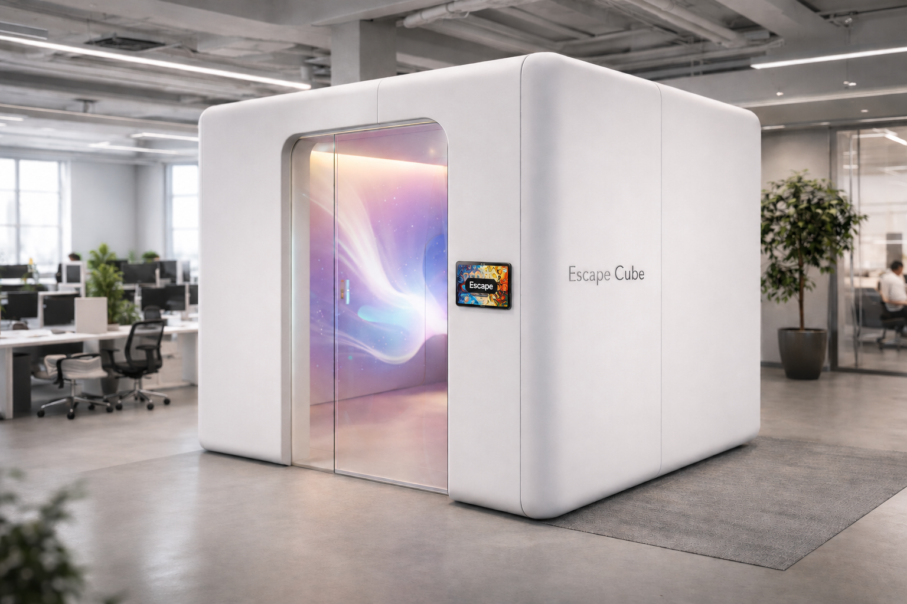
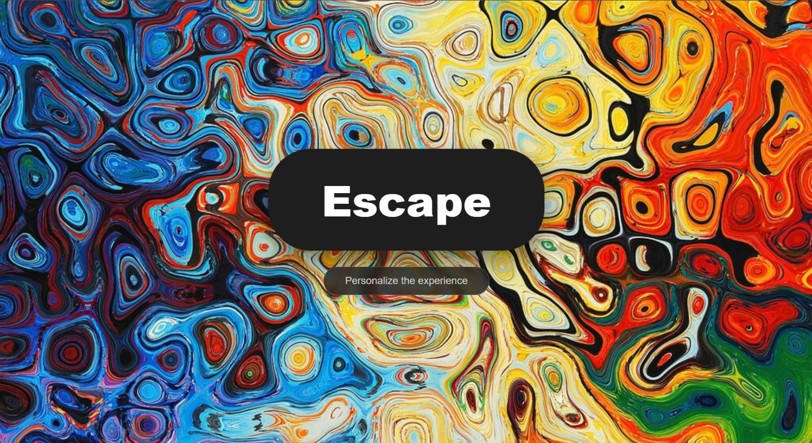
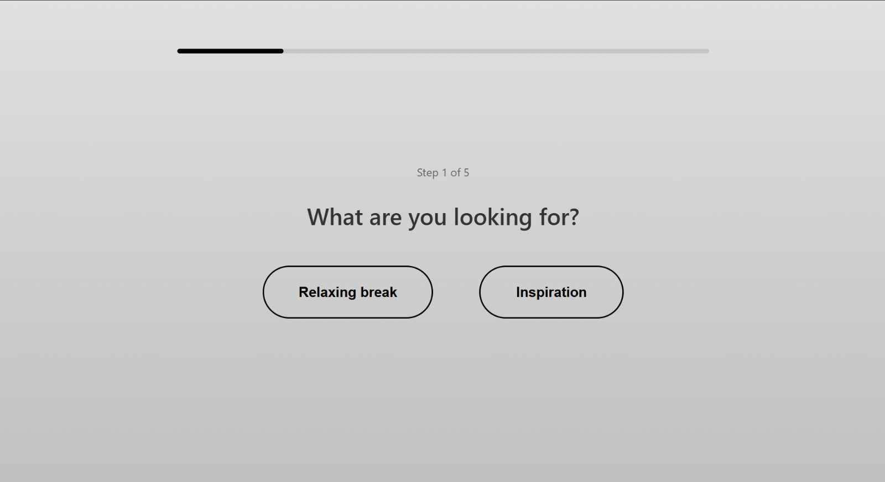
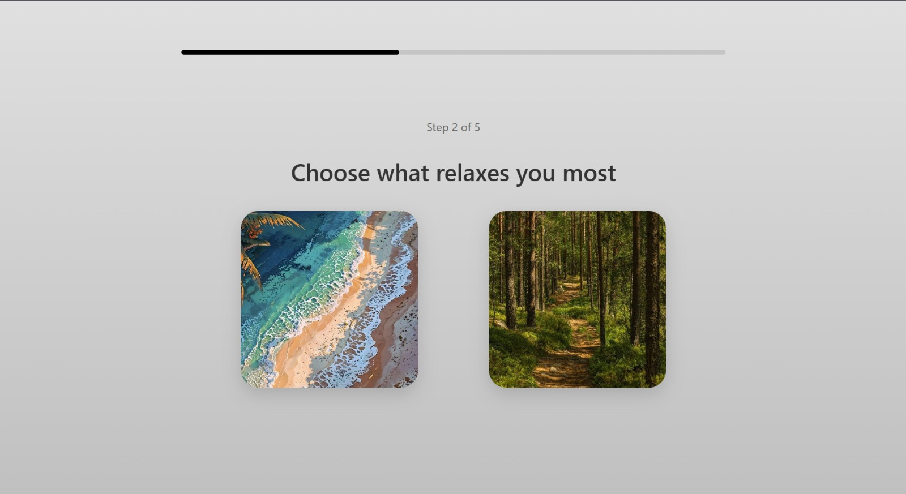

  

  <em>Escape Cube is an immersive experience: a room equipped with projectors and speakers, designed to be a safe place where you can disconnect and recover from stress.</em>

## Introduction

The idea was born for work environments: a space to take a break, recharge, or find inspiration during creative jobs. However, the concept can easily be extended to any situation that causes high stress or anxiety, such as festivals and concerts. In those scenarios, the Escape Cube could become a place to wait for the event to start or, most importantly, a refuge for people experiencing panic attacks due to the crowd.

Even though the full version of the project requires a properly equipped room, on GitHub we present a demo version that you can try directly from your pc: all you need is a pair of headphones and your computer screen to experience it.

---

## Experience

Outside the room there is a touchscreen display where you can choose to personalize your experience or jump straight in with a randomly generated session. If you choose personalization, you are presented with a short questionnaire: first you pick the type of experience you want, if relaxing or inspiring, then you go through a series of image pairs, selecting the one you prefer each time.

  
  

  
  

Once inside, the projections on the walls and the audio are shaped around your choices. For those who want an even more immersive experience, the room is equipped with wearable sensors that measure heart rate and skin humidity, adjusting the projections in real time accordingly.

---

## How to run it

### Prerequisites

Before getting started, make sure you have the following installed on your computer:

- **Node.js** (LTS version) — download it from [nodejs.org](https://nodejs.org/). On Windows, keep the default settings during installation and restart your PC when done.
- **TouchDesigner** — download it from [derivative.ca](https://derivative.ca/).

### Installation and setup

The first time you download the project from GitHub, open the project folder in Visual Studio Code, launch the integrated terminal and type: npm install

This installs all the necessary libraries. Once completed, start the server with: node server.js

Keep the terminal open and running for the entire duration of the experience.

### Trying the demo on your pc

Open your browser (Chrome, Edge or Safari) and go to:

http://localhost:3000

### Tablet connection (physical installation)

To use the application on the physical tablet, the pc and the tablet must be connected to the same Wi-Fi network. Important: university networks block communication between devices — use your smartphone's personal hotspot instead.

1. Connect both the pc and the tablet to your hotspot
2. Find the IP address of your pc:
   - On Windows: open the terminal and type `ipconfig`, then look for the *IPv4 Address* line
   - On Mac: type `ipconfig getifaddr en0`
3. On the tablet, open the browser and enter the pc's IP address followed by `:3000` — for example: `http://192.168.43.50:3000`

## Team

| Name | Student ID | Contribution |
|------|-----------|--------------|
| Antognetti Andrea | 11082358 | Audio design and SuperCollider development |
| Catalano Alessandro | 11080052 | Web application development and Sensors management|
| Molinari Elena | **da mettere** | TouchDesigner visual development |
| Venier Anna | **da mettere** | TouchDesigner visual development |

## Technologies

- **TouchDesigner** — generative visuals and projections
- **Node.js** — local server and communication management
- **SuperCollider** — audio design and real-time sound control
- **Arduino** — wearable sensors management: GSR Sensor (Galvanic Skin Response) & Pulse Sensor (Heart Rate)
- **Socket.io** — real-time communication between server and interface
- **OSC (Open Sound Control)** — communication protocol between Node.js and TouchDesigner
- Se c'è altro inseritelo qua

## Challenges, Accomplishments and Lessons Learned

### Challenges
*What kind of challenges did you run into during this project?*

### Accomplishments
*What are you proud of?*

### Lessons Learned
*What did you learn during the project?*

## Video Demo

### mettere qua il video

